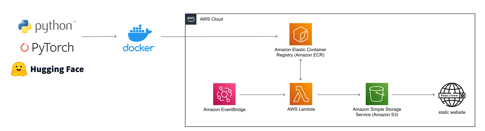

# aws-lambda-container-app
AWS Lambda deep learning application using Docker container image.

## Translates foreign-language material into English and summarizes into bullet-point style.

This project demonstrates AWS Lambda's new support for [container images](https://aws.amazon.com/blogs/aws/new-for-aws-lambda-container-image-support/).

This application uses the [Huggingface transformers](https://huggingface.co/transformers/) neural network library to:

1. Poll a foreign-language RSS feed for new content.
2. Download the relevant material.
3. Translate the text into English using pretrained neural networks from the [Language Technology Research Group](https://blogs.helsinki.fi/language-technology/) at the University of Helsinki.
4. Summarize the material using the [T5 neural network](https://arxiv.org/abs/1910.10683).
5. Publish the results to an AWS S3 bucket configured as a static webpage: [summaries.html](http://web-translation-summarization.s3-website-us-west-1.amazonaws.com/)
